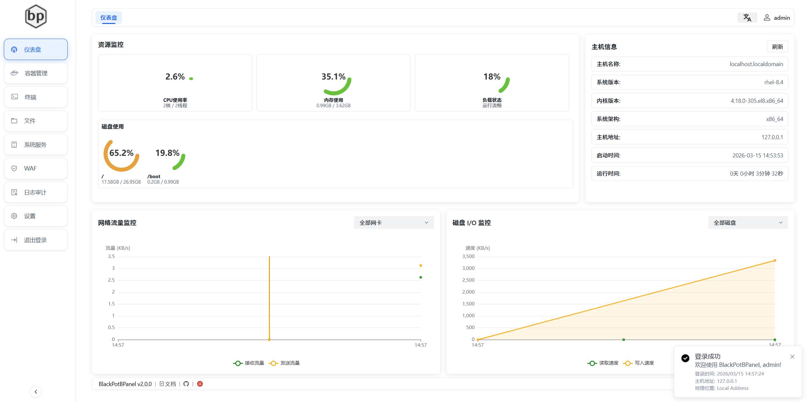
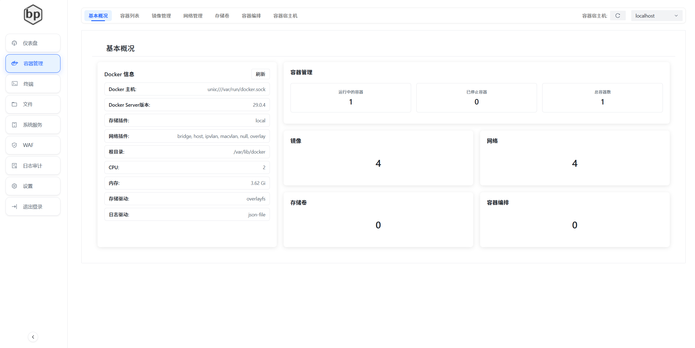
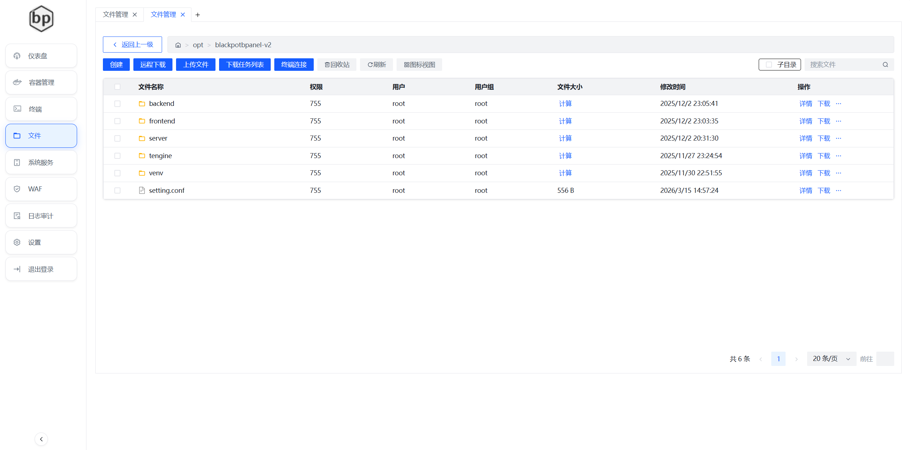
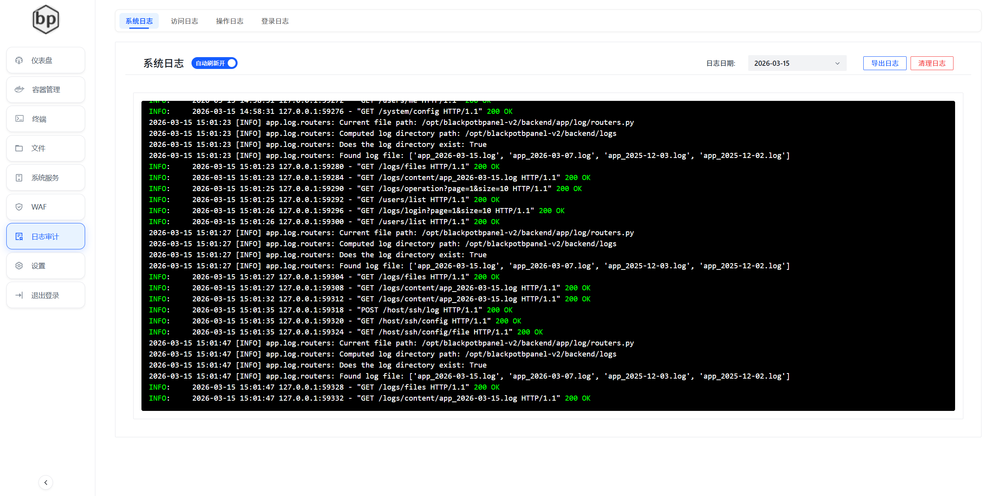

# BlackPotBPanel V2

BlackPotBPanel 是一款使用AI仿照BT面板基于vue+fastapi开发的linux管理面板，写的比较垃圾，只实现了一些基本功能，后续可能会继续完善。

## 演示环境
(https://demo.panel.blackpotbp.cc/)
账号：admin
密码：admin@123

## 环境要求
- Python 3.8 及以上版本
- 操作系统：可尝试CentOS 7/8 或 Ubuntu 18.04/20.04
 
## 安装
请提前安装python3.8及以上版本，并创建好python的虚拟环境

### 前端
请提前安装nodejs 18及以上版本
1. 克隆仓库
```bash
cd blackpotbpanel-v2/frontend
```
2. 安装依赖
```bash
npm install
```
3. 运行项目
```bash
npm run dev
```
4. 打包到后端运行
```bash
npm run build
```
将dist文件的内容复制到backend目录下的web目录下，使用
__init__.py.prod文件将
__init__.py.prod改为__init__.py

### 后端
1. 克隆仓库
```bash
git clone https://gitee.com/ssgghshs/blackpotbpanel-v2.git
cd blackpotbpanel-v2/backend
```
2. 安装依赖
```bash
pip install -r requirements.txt
```
3. 运行项目
```bash
python main.py
```


## 功能
- 简洁易用的可视化操作界面
- 登录功能

- 首页功能

- 容器管理，仅支持docker

- 终端功能

- 文件管理

- 系统服务

- 日志管理

- 系统设置


### 待定功能
- 脚本库
- 定时任务
- 剧本执行
- linux的防火墙管理（firewall/ufw）
- WAF管理（网站功能）
- 访问日志/操作日志

## 国际化
- 支持中文/英文/日文/韩文
